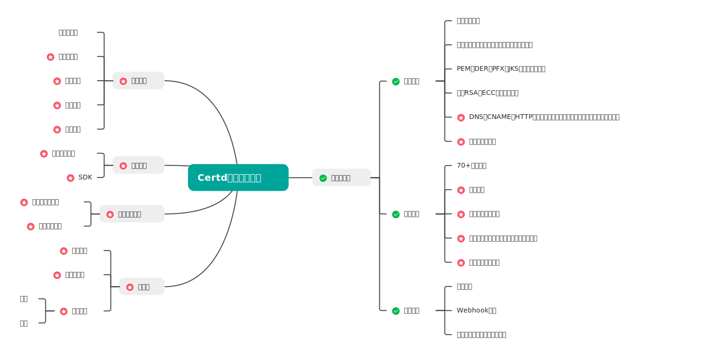

# Certd

Certd 是一款开源、免费、全自动申请和部署更新SSL证书的工具。       
后缀d取自linux守护进程的命名风格，意为证书守护进程。

关键字：证书自动申请、证书自动更新、证书自动续期、证书自动续签、证书管理工具

## 1、关于证书续期
>* 实际上没有办法不改变证书文件本身情况下直接续期或者续签。
>* 我们所说的续期，其实就是按照全套流程重新申请一份新证书，然后重新部署上去。
>* 免费证书过期时间90天，以后可能还会缩短，所以自动化部署必不可少

## 2、特性
本项目不仅支持证书申请过程自动化，还可以自动化部署更新证书，让你的证书永不过期。

* 全自动申请证书（支持所有注册商注册的域名）
* 全自动部署更新证书（目前支持部署到主机、部署到阿里云、腾讯云等，目前已支持60+部署插件）
* 支持通配符域名/泛域名，支持多个域名打到一个证书上
* 邮件通知
* 私有化部署，保障数据安全
* 支持SQLite、Postgresql、MySQL数据库

  

